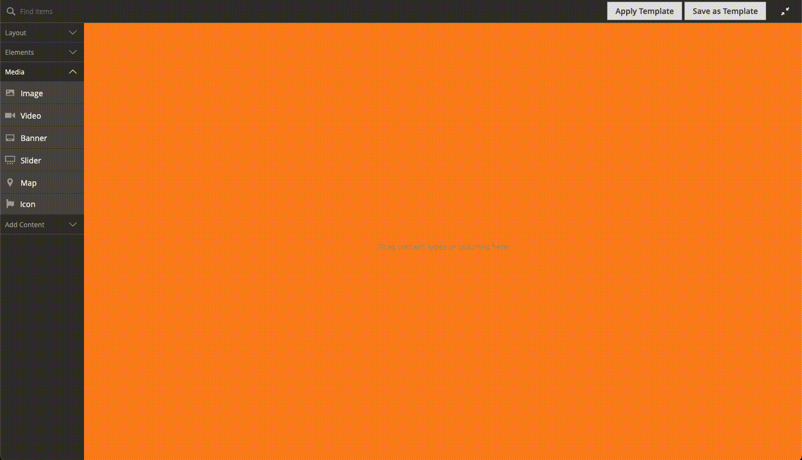

# Font Awesome for Magento Page Builder

## Module purpose
This module aims to make it easy to add icons to Magento Commerce Page Builder pages.

It **is not** intended to be used in production. It is a personal project aiming to make demos of Page Builder quicker and easier to turn around.

This module is provided **as is** and **is not supported in anyway**, use at your own risk.

## Font Awesome
The full Font Awesome 5 Free library is included, which is not optimal for delivery, but gives flexibiltiy for content creation.

Please see [Font Awesome](https://fontawesome.com/) for more details about how to use their great set of icons.

We're using the Free icon set which can be [viewed here](https://fontawesome.com/icons?d=gallery&m=free).

## Installation
Composer instructions to go here.....

## Usage
Once installed, it will show within your Page Builder CMS interface under Media.

Drag the element on to screen, within a row or column, and use the settings to add your icon, choose a colour and pixel size.

## To do
* Test thoroughly
* Default icon font size
* Make icon font size able to use EM, REM and other values other than PX

## Boring stuff

This code is provided "as is" and not intended for production use. It is created to improve my own personal workflow and is not endoresed or supported by myself, my employer or anyone else associated with the code. If you use this, you do so at your own risk, and with full knowledge of what you're doing.